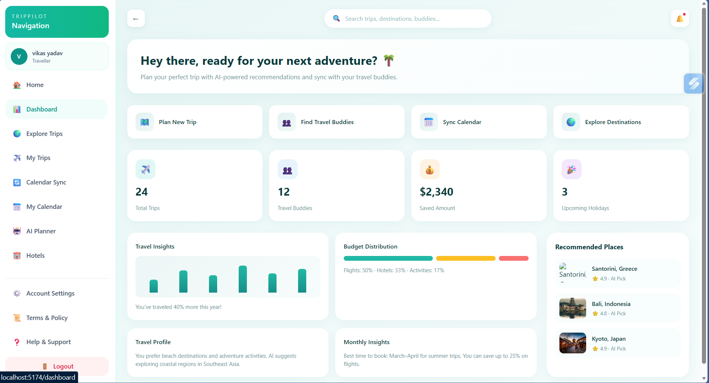

# 🌍 TripPilot – AI Travel Planner ✈️

### *Plan smarter, travel better with AI-powered intelligence*

<p align="center">
  
  
  
  
  
</p>

---

## 🚀 Overview

**TripPilot** is a full-stack AI-powered travel planning platform that simplifies trip organization by generating smart itineraries, recommending hotels, and managing travel data in a seamless experience.

It combines:

* ⚡ A fast, modern **React + Vite frontend**
* 🔐 A secure **Node.js + Express backend**
* 🧠 AI-driven planning logic
* 📦 Scalable architecture for real-world use

---

## ✨ Key Features

### 🤖 AI Trip Planning

* Generate personalized travel itineraries
* Day-wise structured plans
* Smart recommendations based on user input

### 🏨 Hotel Recommendation System

* Dynamic hotel listings
* Location-based suggestions
* Clean card-based UI

### 🔐 Authentication System

* Secure login & registration
* Password hashing with bcrypt
* JWT-based session handling

### 🎨 Modern UI/UX

* Responsive design (mobile + desktop)
* Tailwind CSS styling
* Smooth user experience

### ⚡ Performance Optimized

* Vite-powered frontend (fast reloads)
* Efficient API communication

---

## 🌐 Live Demo

👉 https://trip-pilot.netlify.app

---

## 📸 Screenshots

> *(Add real images in `/screenshots` folder for best impact)*

| Dashboard                        | AI Planner                     | Hotels                        |
| -------------------------------- | ------------------------------ | ----------------------------- |
|  |  |  |

---

## 🏗️ Architecture Overview

```
Frontend (React + Vite)
        ↓ API Calls
Backend (Node + Express)
        ↓
MongoDB Database
```

---

## 🛠️ Tech Stack

### 💻 Frontend

* React 18
* Vite
* Tailwind CSS

### 🖥️ Backend

* Node.js
* Express.js
* MongoDB (Mongoose)

### 🔐 Authentication

* JWT (JSON Web Tokens)
* bcrypt (password hashing)

### ⚙️ Developer Tools

* ESLint
* PostCSS
* Nodemon

---

## 📂 Project Structure

```
.
├── src/                        # React frontend
│   ├── components/            # UI components
│   ├── pages/                 # App pages
│   └── App.jsx
│
└── server/                    # Backend API
    ├── config/                # DB connection
    ├── controllers/           # Logic
    ├── middleware/            # Auth middleware
    ├── models/                # Schemas
    └── routes/                # API routes
```

---

## ⚙️ Backend Setup

```bash
cd server
cp .env.example .env
```

### 🔑 Configure `.env`

```
PORT=5000
MONGODB_URI=mongodb://localhost:27017/trippilot
JWT_SECRET=your_secure_secret
```

### ▶️ Run Server

```bash
npm install
npm run dev
```

---

## 🌐 Frontend Setup

```bash
npm install
npm run dev
```

👉 Runs at: **http://localhost:5173**

---

## 🔗 API Endpoints

| Method | Endpoint             | Description       |
| ------ | -------------------- | ----------------- |
| POST   | `/api/auth/register` | Create account    |
| POST   | `/api/auth/login`    | Authenticate user |

---

## 🔐 Authentication Flow

```text
User Login → JWT Generated → Stored in localStorage → Sent with API requests
```

Example:

```
Authorization: Bearer <token>
```

---

## 📥 API Examples

### Register

```json
{
  "name": "Alex Traveler",
  "email": "alex@example.com",
  "password": "strongPass123",
  "role": "user"
}
```

---

### Login

```json
{
  "email": "alex@example.com",
  "password": "strongPass123"
}
```

---

## 💡 Problem It Solves

Travel planning is:

* Time-consuming
* Overwhelming
* Fragmented across platforms

**TripPilot solves this by:**

* Automating planning with AI
* Centralizing trip data
* Providing smart recommendations

---

## 🚀 Future Enhancements

* 🌙 Dark Mode
* 📍 Google Maps integration
* 💬 AI chatbot assistant
* 📤 Trip sharing via links
* ❤️ Save trips feature
* 🧾 Booking & payments integration

---

## 🧠 What I Learned

* Full-stack application development
* Secure authentication systems
* API design and integration
* Debugging real-world issues
* Building scalable UI systems

---

## 🤝 Contributing

* Follow clean commit structure
* Keep frontend/backend changes separate
* Do not commit `.env` files

---

## 👨‍💻 Author

**Vikas Yadav**
📧 [vikas.yadav.cs27@iilm.edu](mailto:vikas.yadav.cs27@iilm.edu)

---

## ⭐ Support

If you found this project useful:

👉 Star ⭐ the repository
👉 Share it with others

---

<p align="center">
  Made with ❤️ using React & Node.js
</p>
